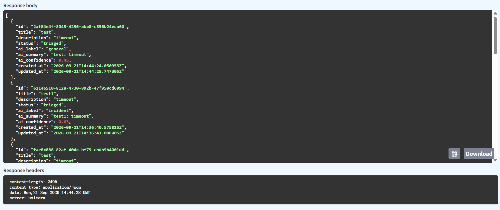
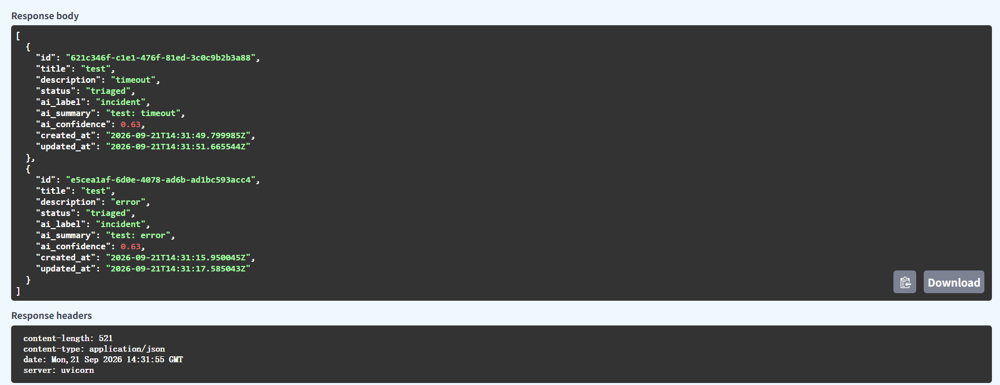

# Week 3 Submission — Individual Readiness Lab

> Delete prompt text before final submission if desired.

## Student information

- Name: Fei Wenxiang
- Student ID: 21395202
- Repository: https://github.com/Fei-stack-wq/MAIE6000c-starter-FWQ-private.git
- Checkpoint tag: `w03-readiness`
- Commit SHA: 5520493a66aa8a5821f9198471c22bf6bf6b170d

## 1. What I changed

Add one keyword ("timeout" → incident) with a unit test

## 2. Files touched

- services\ai\app\main.py
- tests\unit\test_ai_service.py

## 3. How I verified it

- run the test_ai_service.py
- **Behaviour before**: 

- **Behaviour after**:

## 4. Known limitations or notes

The modification to the keywords merely added an alarm mechanism; it did not handle the timeout events.

## 5. AI Use Statement

- claude code
- analyse the structure of the project; give some advice
